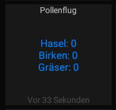

# nodered-dwd-pollination

Get pollination data from DWD (Deutscher Wetterdienst) extract relevant in Node-RED and publish to MQTT


To stay informed about the current pollen count in your area, opendata of the Deutscher Wetterdienst can be downloaded here
https://opendata.dwd.de/climate_environment/health/alerts/s31fg.json

The JSON-file is for all of Germany, to get the values that are interesting for you personally you can build a Node-RED flow.

You can find an example in the GitHUB repository: ***flows-pollination.json***

## FEATURES

- Connect to DWD opendata website
- Get JSON-file https://opendata.dwd.de/climate_environment/health/alerts/s31fg.json
- Parse JSON and extract relevant pollination data at region
- Publish values to MQTT

## FUNCTION NODE

```
region = 19; //19 = Rheinland-Pfalz und Saarland, Mittelgebirgsbereich Rheinland-Pfalz
var messagetext = "Hasel: "+ msg.payload.content[region].Pollen.Hasel.today+"\nBirken: " + msg.payload.content[region].Pollen.Birke.today+"\nGräser: " + msg.payload.content[region].Pollen.Graeser.today;
msg.payload = messagetext;
return msg;
```

Legend 
- 3 = "high pollination"
- 2-3 = "medium to high pollination"
- 2 = "medium pollination"
- 1-2 = "low to medium pollination"
- 1 = "low pollination"
- 0-1 = "no to low pollination"
- 0 = "no pollination"

### EXAMPLE IN MQTTDASH



## LICENSE

nodered-dwd-pollination and all individual scripts are under the BSD 3-Clause license unless explicitly noted otherwise. Please refer to the LICENSE
